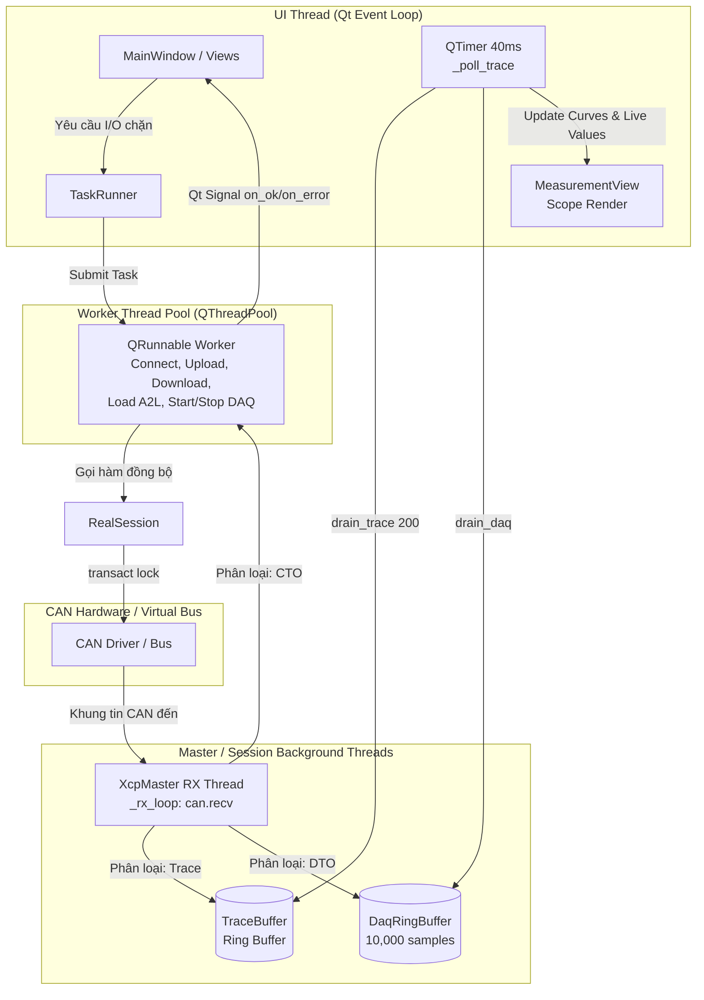
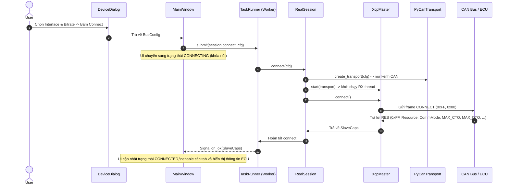
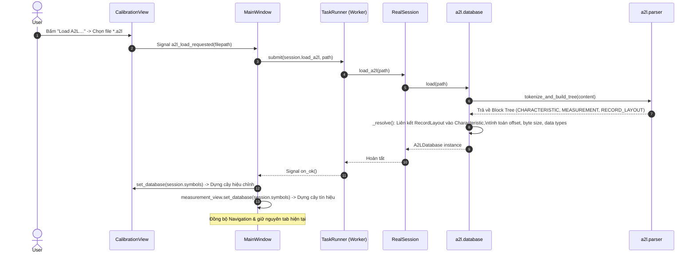
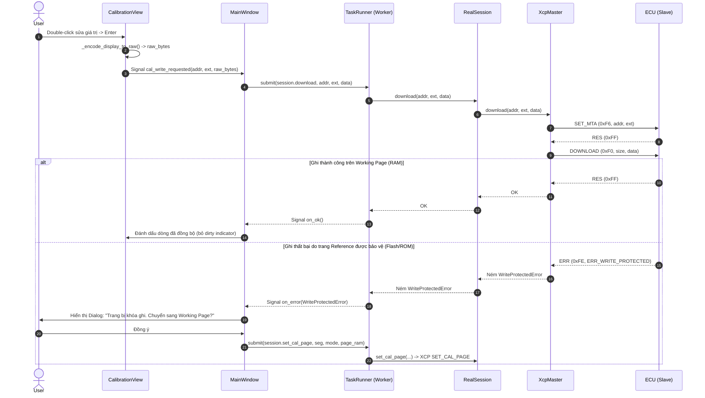
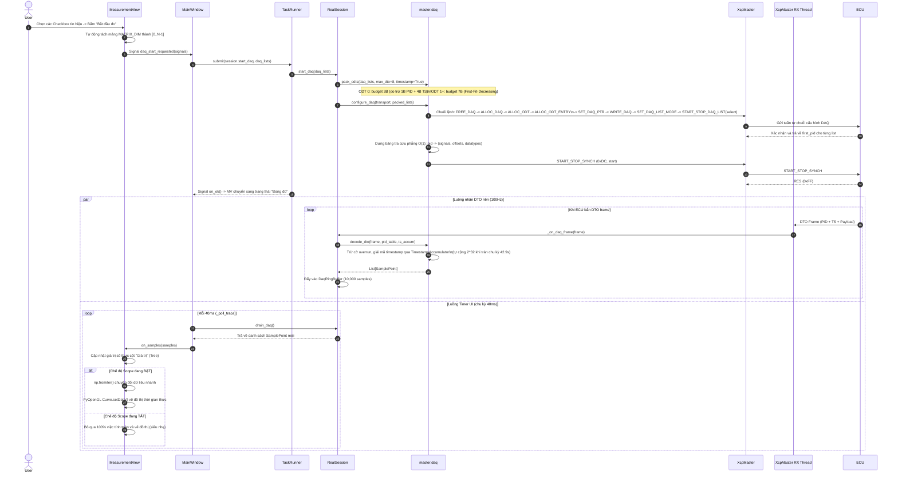
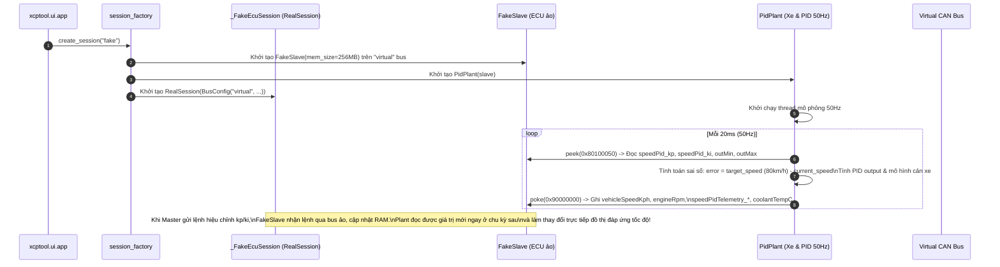

# xcptool — Tài liệu kiến trúc chi tiết (Architecture & Design)

> **Đối tượng đọc:** Kỹ sư phần mềm, kiến trúc sư hệ thống hoặc AI agent tham gia phát triển, bảo trì và mở rộng `xcptool`.
>
> **Nguồn sự thật:** Tài liệu này mô tả chi tiết và chính xác kiến trúc phần mềm tại phiên bản hiện tại (M1 → M5 hoàn thiện, tháng 08/2026). Khi có bất kỳ sự khác biệt nào giữa tài liệu này và các bản phác thảo ý tưởng cũ, luôn tin tưởng tài liệu này và mã nguồn thực tế.

---

## 1. Tổng quan & Triết lý thiết kế (Design Philosophy)

`xcptool` là ứng dụng PC (Python 3.12 + PySide6 / Fluent UI) phục vụ công tác đo lường (Measurement/DAQ) và hiệu chỉnh (Calibration) tham số ECU thông qua giao thức **ASAM XCP on CAN / CAN FD** (thay thế cho CANape/INCA trong các bài toán đo lường tự động và kiểm thử).

Hệ thống được xây dựng dựa trên **bốn nguyên tắc cốt lõi**:

1. **Độc lập tuyệt đối với firmware ECU (`driver/`)**:
   - `xcptool` hoàn toàn không import, không phụ thuộc và không giả định bất kỳ cấu trúc nội bộ nào từ thư mục firmware `driver/` (XCP Slave trên vi điều khiển như Infineon AURIX TC2xx/TC3xx).
   - Quan hệ duy nhất giữa Master và Slave là luồng byte giao tiếp chuẩn XCP trên bus CAN vật lý hoặc bus ảo.

2. **ECU & Hardware-Agnostic (Không phụ thuộc phần cứng cụ thể)**:
   - Không hardcode các thông số kỹ thuật như `MAX_CTO`, `MAX_DTO`, `CAN ID`, thứ tự byte (Endianness), hay đơn vị độ phân giải Timestamp trong mã nguồn logic.
   - Toàn bộ thông số vận hành của ECU được thu thập động thông qua `BusConfig` (do người dùng cấu hình) và `SlaveCaps` (được truy vấn tự động từ ECU qua lệnh `CONNECT`).

3. **FakeSession trước — RealSession sau**:
   - Khung giao tiếp chuẩn hóa qua hợp đồng `session/api.py` cho phép phát triển giao diện (UI) và logic nghiệp vụ (Core) song song độc lập.
   - Chế độ `--session fake` cung cấp môi trường giả lập ECU thật (`FakeSlave`) khép vòng với mô hình động học xe (`PidPlant`), cho phép kiểm thử toàn bộ chuỗi tính năng mà không cần phần cứng CAN thật.

4. **Kiểm soát ranh giới bằng phân tích cú pháp tĩnh (AST Boundary Enforcement)**:
   - Toàn bộ ranh giới kiến trúc và quy tắc cấm phụ thuộc chéo giữa các tầng được kiểm tra tự động ở mức cây cú pháp trừu tượng (AST) qua `tests/test_boundaries.py` ở mỗi lần chạy test.

---

## 2. Tổ chức các tầng (Layer Architecture) & Module Breakdown

Hệ thống được tổ chức theo mô hình phân tầng nghiêm ngặt (Strict Layered Architecture). Mỗi tầng chỉ giao tiếp với tầng liền kề hoặc thông qua Contract trừu tượng.

```
┌────────────────────────────────────────────────────────────────────────┐
│  Presentation Layer                                                    │
│  - ui/   (MainWindow, CalibrationView, MeasurementView, TraceView,     │
│           MemoryView, ConsoleView, DeviceDialog, DockManager, Theme)   │
│  - cli/  (Command Line Interface: devices, connect, read, write, ...)  │
└───────────────────────────────────┬────────────────────────────────────┘
                                    │  Chỉ tương tác qua Session Protocol
┌───────────────────────────────────▼────────────────────────────────────┐
│  Contract & Session Layer                                              │
│  - session/api.py      Contract giao diện, Dataclasses, Exception Tree │
│  - session/real.py     RealSession (Cầu nối giữa Master, A2L, Driver)  │
│  - session/fake.py     FakeSession (Stub nhẹ phục vụ test UI đơn lập)  │
└───────┬────────────────────────────────────────────────┬───────────────┘
        │ RealSession điều phối                          │ FakeSession
┌───────▼──────────────────┐  ┌────────────────────────┐ ┌───────▼───────┐
│  Domain / Protocol Layer │  │  A2L Parser Layer      │ │ (UI Test Stub)│
│  - master/core.py        │  │  - a2l/parser.py       │ └───────────────┘
│    (XcpMaster, RX Thread)│  │  - a2l/database.py     │
│  - master/daq.py         │  │  - a2l/types.py        │
│    (DAQ Engine, Pack ODT)│  └────────────────────────┘
│  - master/codec.py       │
│  - master/trace.py       │
└───────┬──────────────────┘
        │ Giao thức Link (send/recv/close)
┌───────▼──────────────────────────────────────────────┐
│  Transport Layer                                     │
│  - transport/registry.py (Quản lý đa backend)        │
│  - transport/pycan.py    (Cầu nối python-can)        │
│  - Backends: PEAK, Vector, ETAS, slcan, virtual      │
└──────────────────────────────────────────────────────┘
        ▲                                      ▲
        │ CAN frames                           │ Virtual Bus
┌───────┴──────────────────────────────────────┴───────┐
│  Simulation & DevTools (Chỉ nạp khi test/demo)       │
│  - devtools/fakeslave.py (ECU ảo chuẩn XCP)          │
│  - devtools/pid_plant.py (Mô hình vật lý xe 50Hz)    │
└──────────────────────────────────────────────────────┘
```

### 2.1 Chi tiết trách nhiệm từng Package / Module

| Module / Package | File chính | Trách nhiệm kiến trúc |
|---|---|---|
| **`xcptool.session`** | `api.py`<br>`real.py`<br>`fake.py` | **Contract ranh giới duy nhất**. Định nghĩa toàn bộ kiểu dữ liệu nghiệp vụ (`BusConfig`, `SlaveCaps`, `A2LDatabase`, `SamplePoint`, `DaqList`), cây ngoại lệ chuẩn và lớp hiện thực `RealSession`. Tách rời hoàn toàn giao diện khỏi chi tiết protocol. |
| **`xcptool.master`** | `core.py`<br>`daq.py`<br>`codec.py`<br>`trace.py`<br>`constants.py` | **Domain Protocol & DAQ Engine**. Quản lý kết nối XCP, mã hóa/giải mã frame CTO, thực thi giao dịch đồng bộ chống reentrancy, luồng nhận RX nền, thuật toán đóng gói ODT (`pack_odts`), cấu hình DAQ (`configure_daq`), giải mã DTO (`decode_dto`) và bộ tích lũy chống tràn Timestamp (`TimestampAccumulator`). |
| **`xcptool.a2l`** | `parser.py`<br>`database.py`<br>`types.py` | **ASAM MCD-2 MC Parser**. Tự viết block-tree parser chuẩn hóa (không dùng thư viện ngoài), bóc tách các block `CHARACTERISTIC`, `MEASUREMENT`, `RECORD_LAYOUT`, `IF_DATA`, liên kết RecordLayout với biến và hỗ trợ phân rã mảng / struct. |
| **`xcptool.transport`** | `registry.py`<br>`pycan.py`<br>`config.py`<br>`quiet.py` | **Hardware Abstraction Layer**. Đăng ký và quản lý các driver CAN (PEAK PCAN, Vector XL, ETAS BOA, CANable slcan, Virtual CAN). Xử lý chuẩn hóa DLC (pad 8 byte cho CAN Classic hoặc pad theo chuẩn CAN FD 64 byte), lọc thông điệp êm (`quiet.py`). |
| **`xcptool.ui`** | `main_window.py`<br>`calibration_view.py`<br>`measurement_view.py`<br>`trace_view.py`<br>`memory_view.py`<br>`console_view.py`<br>`device_dialog.py`<br>`dock_manager.py`<br>`theme.py` | **Presentation Layer (PySide6 / Fluent)**. Giao diện người dùng hiện đại, quản lý Docking, đồng bộ theme Dark/Light, điều phối tác vụ I/O qua `TaskRunner` (không bao giờ block UI thread), biểu diễn đồ thị real-time OpenGL/NumPy (`pyqtgraph`), phân cấp cây thông số Struct/Array. |
| **`xcptool.devtools`** | `fakeslave.py`<br>`pid_plant.py` | **Simulation Environment**. Cung cấp `FakeSlave` xử lý lệnh XCP thật qua virtual CAN bus và `PidPlant` mô phỏng hành vi động học xe (PID controller, tốc độ xe, RPM, nhiệt độ nước làm mát) phục vụ kiểm thử end-to-end tự động. |
| **`xcptool.cli`** | `main.py` | **Command Line Consumer**. Cung cấp giao diện dòng lệnh độc lập sử dụng chung Contract `Session`. |

---

## 3. Mô hình đa luồng & An toàn luồng (Threading & Concurrency Model)

Để đảm bảo giao diện luôn mượt mà ở tốc độ 60 FPS ngay cả khi bus CAN bị flood hàng nghìn frame mỗi giây, `xcptool` áp dụng kiến trúc đa luồng phân định rõ ranh giới:



### 3.1 Các nguyên tắc an toàn luồng (Thread-Safety Rules)

1. **Session không phụ thuộc Qt**:
   - Tầng `session/`, `master/`, `transport/`, `a2l/` hoàn toàn không import `PySide6`. Session không bao giờ gọi ngược (callback) trực tiếp lên UI.
2. **Không gọi I/O chặn trên UI Thread**:
   - Toàn bộ phương thức thuộc nhóm I/O (`connect`, `upload`, `download`, `get_cal_page`, `set_cal_page`, `copy_cal_page`, `load_a2l`, `start_daq`, `stop_daq`, `raw_command`) bắt buộc phải bọc trong `TaskRunner` (`QRunnable`) chạy tại `QThreadPool`.
   - Kết quả hoặc ngoại lệ được trả về UI thread thông qua cơ chế Signal/Slot của Qt (`on_ok`, `on_error`).
3. **Master Transaction Lock (Chống Reentrancy)**:
   - `XcpMaster.transact()` được bảo vệ bởi `threading.Lock(blocking=False)`. Nếu một lệnh mới được gửi xuống trong khi lệnh trước chưa nhận được phản hồi (hoặc chưa timeout), hệ thống ném ngay ngoại lệ `BusyError` thay vì làm hỏng hàng đợi trên bus.
4. **Cơ chế Ring Buffer xả theo nhịp (Polling Throttling)**:
   - Frame trace và điểm đo DAQ được đẩy liên tục vào Ring Buffer nội bộ thread-safe (`deque(maxlen=...)`).
   - UI thread sử dụng một `QTimer` duy nhất (chu kỳ 40ms) gọi `drain_trace(max_items=200)` và `drain_daq()`. Việc giới hạn số lượng frame tối đa mỗi tick giúp loại bỏ hiện tượng đông cứng UI khi vừa khởi động DAQ.

---

## 4. Chi tiết các luồng giao tiếp & tương tác (Sequence Diagrams)

### 4.1 Luồng Khởi tạo & Kết nối Thiết bị (Device Connection & Capability Discovery)

Khi người dùng chọn thiết bị trong `DeviceDialog` và bấm **Connect**:



---

### 4.2 Luồng Nạp A2L & Phân tích Cấu trúc Biến (A2L Parsing & Symbol Resolution)



---

### 4.3 Luồng Hiệu chỉnh Tham số & Quản lý Trang (Calibration Read/Write & Page Handling)

Khi người dùng sửa một giá trị thông số trong `CalibrationView`:



---

### 4.4 Luồng Cấu hình DAQ & Thu thập Dữ liệu Tốc độ cao (DAQ Engine & Real-Time Scope)

Luồng xử lý dữ liệu đo lường tần số cao từ 50Hz đến 100Hz:



---

### 4.5 Luồng Giả lập Xe & ECU khép vòng (`--session fake`)

Chế độ `--session fake` không dùng mock data giả tạo mà xây dựng một môi trường mô phỏng vật lý chân thực:



---

## 5. Ranh giới kiến trúc & Kiểm soát phụ thuộc (AST Boundary Enforcement)

Mọi ranh giới giữa các tầng được kiểm soát tự động thông qua công cụ phân tích tĩnh `tests/test_boundaries.py`. Khi chạy `pytest`, bài test sẽ phân tích toàn bộ cây cú pháp (AST) của tất cả các file Python để phát hiện sớm các vi phạm import.

### 5.1 Ma trận quy tắc Import

| Package / Module | Được phép Import | Bị CẤM Import | Lý do kiến trúc |
|---|---|---|---|
| **`master/`** | Python stdlib, `session.api` | `can`, `PySide6`, `xcptool.ui`, `xcptool.transport`, `xcptool.cli` | Giữ protocol core độc lập hoàn toàn với transport phần cứng và GUI framework. |
| **`transport/`** | Python stdlib, `can` (python-can), `session.api` | `PySide6`, `xcptool.ui`, `xcptool.master`, `xcptool.cli` | Tầng transport chỉ phục vụ việc truyền nhận byte thô, không biết về logic XCP. |
| **`a2l/`** | Python stdlib | `can`, `PySide6`, `xcptool.master`, `xcptool.ui`, `xcptool.session` | Module parser A2L thuần túy, có thể tái sử dụng cho các dự án khác độc lập. |
| **`ui/`** | Python stdlib, `PySide6`, `qfluentwidgets`, `pyqtgraph`, `session.api` | `can`, `xcptool.master`, `xcptool.transport`, `xcptool.a2l` | UI chỉ được tương tác với backend thông qua Contract `Session`. |
| **`cli/`** | Python stdlib, `session.api` | `can`, `xcptool.master`, `xcptool.transport`, `xcptool.a2l` | CLI chỉ sử dụng Contract `Session`. |
| **`session/api.py`** | Python stdlib (`typing`, `dataclasses`, `enum`, `pathlib`) | `can`, `PySide6`, `xcptool.master`, `xcptool.transport`, `xcptool.ui` | Contract tinh khiết, không kéo theo bất kỳ dependency ngoài nào. |

---

## 6. Sơ đồ cấu trúc thư mục mã nguồn

```
xcptool/
├── ARCHITECTURE.md              Tài liệu kiến trúc hệ thống (file này)
├── USER_MANUAL.md                Hướng dẫn sử dụng chi tiết cho người dùng
├── DEV_PLAN.md                   Kế hoạch phát triển & theo dõi milestone
├── pyproject.toml                Khai báo dự án, dependencies & cấu hình pytest
├── config.toml                   File lưu cấu hình runtime (bitrate, device, last A2L)
├── setup.bat / run.bat           Script tự động cài đặt môi trường và khởi chạy
├── tests/
│   ├── test_boundaries.py        Kiểm tra ranh giới kiến trúc bằng AST
│   ├── unit/                     Unit tests: parser A2L, pack ODT, decode DTO
│   ├── integration/              Integration tests: RealSession + FakeSlave qua virtual bus
│   └── ui/                       UI tests (PySide6 / pytest-qt headless)
└── src/xcptool/
    ├── session/                  CONTRACT & Quản lý phiên
    │   ├── api.py                Contract Protocol, Dataclasses & Exception Tree
    │   ├── real.py               RealSession (Hiện thực kết nối XCP thật & ảo)
    │   └── fake.py               FakeSession (Stub test UI độc lập)
    ├── master/                   XCP Protocol Core & DAQ Engine
    │   ├── core.py               XcpMaster (RX thread, transaction lock, XCP commands)
    │   ├── daq.py                Thuật toán pack_odts, configure_daq, decode_dto
    │   ├── codec.py              Phân loại frame & định dạng chuỗi
    │   ├── constants.py          Mã lệnh XCP, Error Codes, PID enums
    │   ├── errors.py             Ánh xạ lỗi XCP Slave
    │   └── trace.py              TraceBuffer ring buffer
    ├── a2l/                      ASAM MCD-2 MC Parser
    │   ├── parser.py             Block-tree tokenizer & recursive parser
    │   ├── types.py              Dataclasses DataType, RecordLayout, Measurement
    │   └── database.py           A2LDatabase loader & symbol resolver
    ├── transport/                Tầng trừu tượng phần cứng CAN
    │   ├── registry.py           Đăng ký & khởi tạo BackendSpec
    │   ├── pycan.py              Wrapper python-can (hỗ trợ CAN & CAN FD)
    │   └── config.py             Quản lý cấu hình bus CAN
    ├── devtools/                 Môi trường giả lập & phát triển
    │   ├── fakeslave.py          ECU giả lập giao thức XCP trên virtual bus
    │   └── pid_plant.py          Mô phỏng xe & bộ điều khiển PID 50Hz
    ├── ui/                       Giao diện đồ họa Fluent
    │   ├── app.py                Entrypoint GUI & xử lý crash hook
    │   ├── main_window.py        MainWindow điều phối, Navigation & TaskRunner
    │   ├── calibration_view.py   Panel hiệu chỉnh tham số A2L & quản lý trang
    │   ├── measurement_view.py   Panel đo lường DAQ, Live values & Scope OpenGL
    │   ├── trace_view.py         Panel CAN Trace thời gian thực với bộ lọc DTO
    │   ├── memory_view.py        Panel đọc/ghi bộ nhớ Hex thô
    │   ├── console_view.py       Panel nhập & gửi lệnh XCP thô
    │   ├── device_dialog.py      Hộp thoại cấu hình & phát hiện thiết bị CAN
    │   ├── dock_manager.py       Quản lý thu/phóng Docking widgets
    │   ├── session_factory.py    Factory khởi tạo Session theo mode (fake/real)
    │   ├── theme.py              QSS định kiểu Dark/Light Fluent
    │   └── workers.py            TaskRunner & Worker thread pool
    └── cli/                      Giao diện dòng lệnh (CLI commands)
        └── main.py               Entrypoint CLI xcptool
```

---

## 7. Kế hoạch nâng cấp đang chờ triển khai

> Tài liệu này (theo banner ở đầu) chỉ mô tả kiến trúc **đã có trong code**.
> Mục này là ngoại lệ có chủ đích: liệt kê thay đổi kiến trúc đã chốt spec
> nhưng **chưa viết code** — để không lẫn với phần còn lại (vốn phải luôn
> đúng với mã nguồn thực tế).

### 7.1 A2L struct thật (TYPEDEF_STRUCTURE/INSTANCE) thay heuristic đặt tên

**Trạng thái: đã triển khai (2026-09-16).** Xem
[`docs/superpowers/specs/2026-09-11-a2l-struct-typedef-design.md`](docs/superpowers/specs/2026-09-11-a2l-struct-typedef-design.md)
và [`DESIGN.md §8`](DESIGN.md).

Ảnh hưởng tới bảng §2.1 và sơ đồ §4.2 khi triển khai xong:
- `xcptool.a2l` sẽ thật sự đọc được `TYPEDEF_STRUCTURE`/`STRUCTURE_COMPONENT`/
  `TYPEDEF_CHARACTERISTIC`/`TYPEDEF_MEASUREMENT`/`INSTANCE` (hiện tại dòng "hỗ
  trợ phân rã... struct" ở bảng §2.1 nói về việc UI tự đoán theo tên, KHÔNG
  phải parser đọc struct thật — spec này làm nó đúng nghĩa đen lần đầu tiên).
- `_resolve()` trong sơ đồ §4.2 sẽ có thêm bước resolve `INSTANCE` đệ quy
  (struct lồng struct, mảng struct) thành địa chỉ tuyệt đối, materialize
  thẳng vào `A2LDatabase.characteristics`/`measurements` — không đổi gì ở
  các bước sau (session/master/transport không biết hay cần biết gì khác).
- `calibration_view.py`/`measurement_view.py` dựng cây từ `db.instances`
  thay vì `_group_by_prefix` (2 bản hiện có, độc lập nhau, sẽ bị xoá cả hai).
